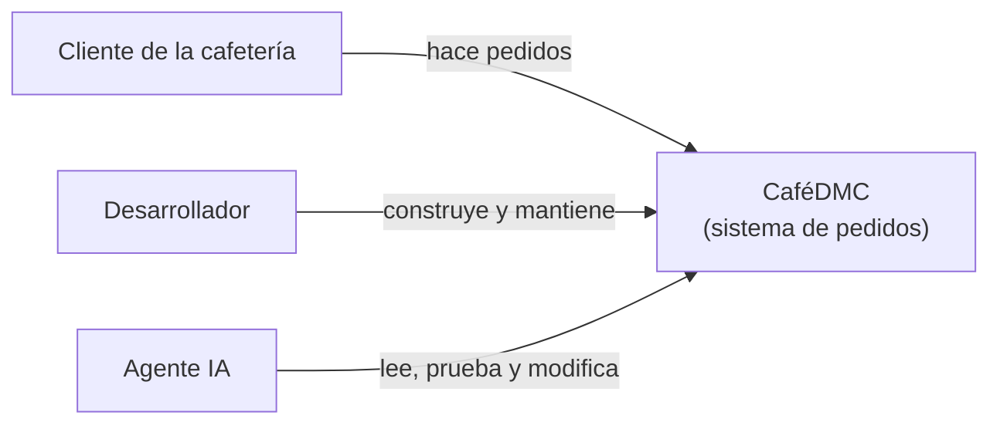
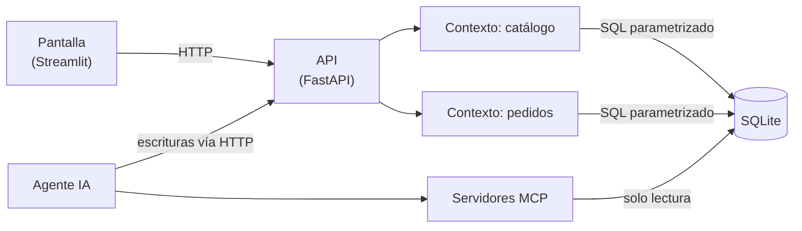

# Arquitectura — CaféDMC

## 1. Contexto (C4)

```mermaid
flowchart LR
    cliente["Cliente de la cafetería"]
    dev["Desarrollador"]
    ia["Agente IA"]
    sistema["CaféDMC\n(sistema de pedidos)"]

    cliente -->|hace pedidos| sistema
    dev -->|construye y mantiene| sistema
    ia -->|lee, prueba y modifica| sistema
```

## 2. Contenedores (C4)

```mermaid
flowchart LR
    pantalla["Pantalla\n(Streamlit)"]
    api["API\n(FastAPI)"]
    catalogo["Contexto: catálogo"]
    pedidos["Contexto: pedidos"]
    db[("SQLite")]
    ia["Agente IA"]
    mcp["Servidores MCP"]

    pantalla -->|HTTP| api
    api --> catalogo
    api --> pedidos
    catalogo -->|SQL parametrizado| db
    pedidos -->|SQL parametrizado| db

    ia --> mcp
    mcp -->|solo lectura| db
    ia -->|escrituras vía HTTP| api
```
